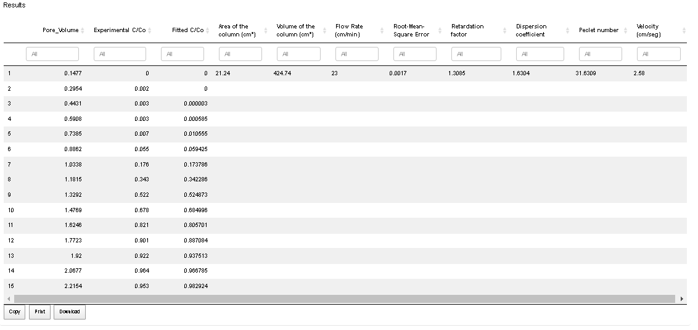
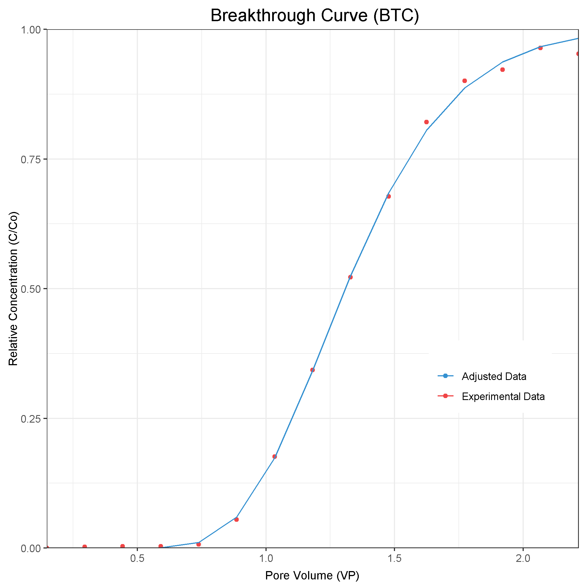
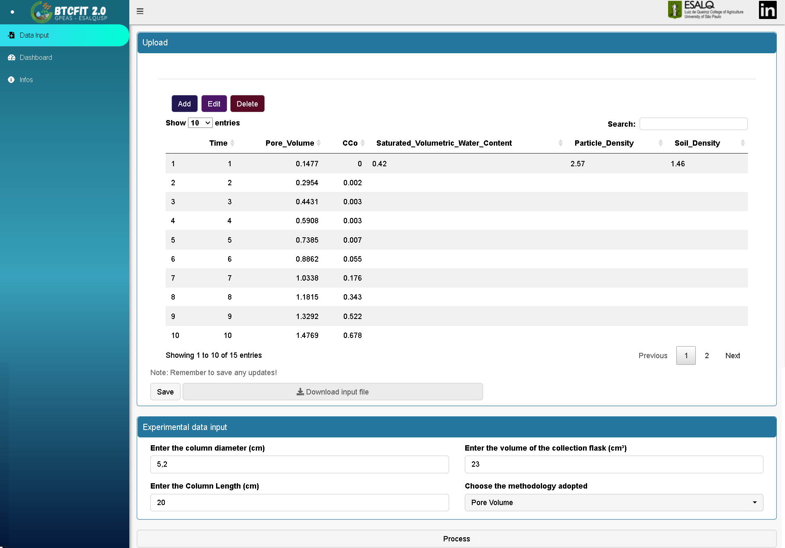
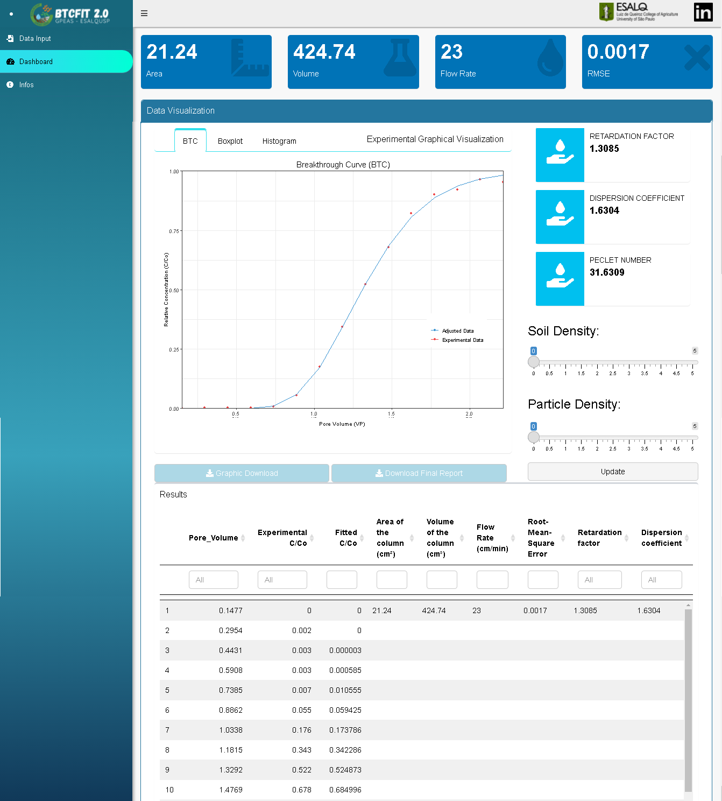

<!-- README.md is generated from README.Rmd. Please edit that file -->

```{r, include = FALSE}
knitr::opts_chunk$set(
  collapse = TRUE,
  eval = FALSE,
  comment = "#>",
  fig.path = "man/figures/README-",
  out.width = "100%"
)
library(knitr)
```

# BTCfit

BTCfit is a computational package/routine for obtaining equilibrium transport parameters from miscible displacement experiments by numerically fitting Breakthrough Curves (BTC's), in a more efficient and user-friendly way.

Browse its [source code](https://github.com/jvnicoletti/BTCfit), or read this document for a tutorial.

# Brief descriptive overview of each function

`numerical_fit_TIME()` - Performs the numerical adjustment of the relative concentration of solutes through the time-based methodology (check inputs), and returns a dataframe with the fitted values and transport parameters.

`numerical_fit_PV()` - Performs the numerical adjustment of the relative concentration of solutes through the Pore Volume based methodology (check inputs), and returns a dataframe with the fitted values and transport parameters.

`plot_BTC()` - Returns the plot of the BTCs adjusted by BTCfit.

`run_app()` - releases the above-mentioned complete routine in the form of a shiny application for a better UX.


# Detailed description of the main functions

# numerical_fit_TIME()

INPUTS:

`time` - Time elapsed between each experimental observation - LIST.

`CCo` - Relative concentration between each experimental observation - LIST.

`flask_volume` - Volume of the solute collection flask (cm³) - Numerical Input.

`column_length` - total length of soil column (cm) - Numerical Input.

`column_diameter` - total diameter of soil column (cm) - Numerical Input.

`soil_density` - Soil density for the soil under analysis (g. cm-3) - Numerical Input.

`particle_density` - Particle density for the soil under analysis (g. cm-3) - Numerical Input.

OUTPUTS:

Returns a table with the experimental information, numerical fit of the relative concentration, transport parameters, and RMSE. 

Example:

  


# numerical_fit_PV()

INPUTS:

`PV` - Pore Volume measured between each experimental observation - LIST.

`CCo` - Relative concentration between each experimental observation - LIST.

`saturated_volumetric_water_content` - Measured Saturated Volumetric Water Content - Numerical Input.

`flask_volume` - Volume of the solute collection flask (cm³) - Numerical Input.

`column_length` - total length of soil column (cm) - Numerical Input.

`column_diameter` - total diameter of soil column (cm) - Numerical Input.

OUTPUTS:

Returns a table with the experimental information, numerical fit of the relative concentration, transport parameters, and RMSE. 

Example:

  
  


# plot_BTC()

INPUTS:

`PV` - Pore Volume measured between each experimental observation (as exported in one of the above functions).

`CCo` - Relative concentration between each experimental observation (as exported in one of the above functions).

`Fitted` - Numerical fit of the relative concentration (as exported in one of the above functions).

OUTPUTS:

 - Returns the plot of the BTCs adjusted by BTCfit.
 
 Example:
  


### Complete Example

Although not part of the R package standard, we recommend creating a readme file that gives additional narrative description about your package. We recommend writing the file in Markdown or R Markdown [@allaire_rmarkdown:_2016]. To create the R Markdown file, use the following function from the usethis package:

```{r, echo=TRUE}
MRE <- xlsx::read.xlsx("./inst/app/www/MRE_Script.xlsx",sheetIndex = 1) %>% 
  tidyr::as_tibble()

fitted_MRE <- numerical_fit_TIME(MRE$Time,
                                 MRE$CCo,
                                 23,
                                 20,
                                 5.2,
                                 1.46,
                                 2.57)

BTC <- plot_BTC(fitted_MRE$PV,MRE$CCo,fitted_MRE$Fitted)

```


 


### BTCfit - ShinyAPP

 Data Input Example:
 
 

 Dashboard Example:
 
  

### GitHub

You can install the BTCfit package with:

```{r}
devtools::install_github("jvnicoletti/BTCfit")
```

